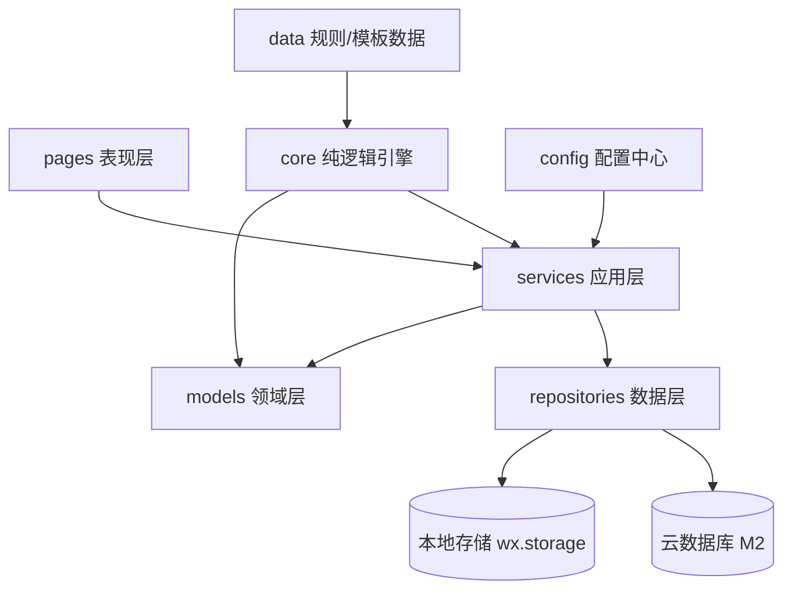
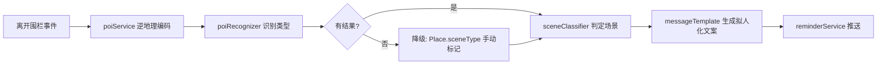
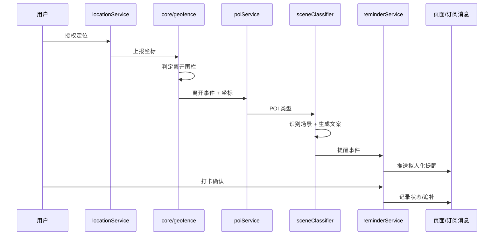

# 架构设计

> 面向单人开发，追求「模块边界清晰、可单测、可平滑演进」。
> 原则：页面不直接碰存储；核心逻辑写成纯函数；数据访问通过仓库层抽象；**场景识别是一条独立可降级的管线**。

## 1. 设计原则

1. **页面只做展示与交互**，业务逻辑下沉到 services
2. **数据访问走 repository 抽象**：M1 用本地存储，M2 切云数据库时只替换实现，不动上层
3. **触发引擎与 UI 解耦**：定位监听、围栏判定独立成模块，页面订阅结果
4. **核心算法纯函数化**：围栏判定、POI 识别、场景分类可脱离小程序环境单测
5. **场景识别管线化**：位置 → POI → 场景 → 文案 → 推送，每个环节独立、可替换、可降级
6. **规则与代码分离**：POI 类型映射、关键词、文案模板都是数据（JSON），社区可贡献
7. **用户界面去概念化**：地点/围栏/POI 均为后台数据，用户界面只呈现清单与提醒

## 2. 分层总览



## 3. 模块职责

| 层 | 目录 | 职责 |
|---|---|---|
| 表现层 | pages/ | 页面渲染、事件绑定；不写业务逻辑 |
| 应用层 | services/ | placeService / checklistService / locationService / reminderService / poiService / sceneService / messageService |
| 领域层 | models/ | Place、ChecklistItem 等数据结构与校验 |
| 纯逻辑 | core/ | geofence.js / habit.js / timer.js / poiRecognizer.js / sceneClassifier.js / messageTemplate.js |
| 规则数据 | data/ | poi-rules.json（POI→类型映射）/ scene-templates.json（场景文案）/ templates.json |
| 数据层 | repositories/ | localRepo（现有）、cloudRepo（M2），同一接口 |
| 配置 | config/index.js | 云环境 ID、腾讯位置服务 key、默认半径、推送模板 ID |

## 4. 关键决策

### 4.1 仓库模式（Repository）
所有数据读写统一走 repository 接口（如 getPlaces / savePlace）。
- 现状：utils/store.js 直连 wx.storage
- 演进：新增 repositories/cloudPlaceRepo.js 实现同一接口，切换由配置决定
- 收益：M2 接云同步时页面与 services 零改动

### 4.2 定位与触发引擎
- locationService：封装 wx.startLocationUpdateBackground、授权状态、错误处理
- core/geofence：给定场所圆心与半径，判定 inside/outside，含去抖
- core/habit：记录实际离开时间，7 天学习后提前 15 分钟触发
- reminderService：聚合多个触发源（围栏 / 习惯定时 / 手动），统一产出提醒事件

### 4.3 场景识别管线（核心新增）



- poiService：云函数调用腾讯位置服务逆地理编码，返回周边 POI（名称 + 类型）
- core/poiRecognizer：纯函数，POI 名称/类型匹配 data/poi-rules.json 关键词，输出类型（home/office/hotel/restaurant/gym/other）
- 降级链：自动识别失败 → 用用户手动标记的 Place.sceneType → 再不行用通用文案
- core/sceneClassifier：纯函数，结合场景类型 + 上下文（时间、是否异地）判定场景（通勤/旅游/差旅/日常）
- core/messageTemplate：纯函数，data/scene-templates.json 渲染拟人化文案，如：
  检测到您离开「{poi}」，是在旅游吗？别忘了带：{items}

### 4.4 规则与代码分离
data/poi-rules.json 与 data/scene-templates.json 是纯数据，社区可通过 PR 补充：
- POI 关键词：酒店/宾馆/民宿 → hotel；大厦/科技园/写字楼 → office；小区/公寓/花园 → home；餐厅/火锅/烧烤 → restaurant
- 文案模板：按场景提供有温度的提醒话术

### 4.5 模板数据化
清单预设从 JS 常量迁移为 data/templates.json，仓库维护，社区可 PR。

### 4.6 配置中心
config/index.js 集中管理：云开发环境 ID、腾讯位置服务 key、默认围栏半径、订阅消息模板 ID、天气 API。

## 5. 数据模型

```text
Place {
  id, name, address,
  latitude, longitude, radius,
  items: string[],              // 清单物品
  checkedMap: { index: bool },
  sceneType,                    // home/office/hotel/restaurant/gym/other（手动标记）
  poiName,                      // 添加时的 POI 名称（如 xx酒店）
  autoSceneType,                // POI 自动识别结果（M3）
  createdAt
}

ReminderEvent {
  source: 'geofence' | 'habit' | 'manual' | 'poi',
  placeId, items, pendingItems,
  sceneType,                    // 识别出的场景
  message,                      // 拟人化文案
  at
}
```

## 6. 触发链路（目标态）



## 7. 目录结构（目标态）

```text
miniprogram/
├── app.js / app.json / app.wxss
├── config/index.js
├── models/
│   ├── place.js
│   └── checklist.js
├── services/
│   ├── placeService.js
│   ├── checklistService.js
│   ├── locationService.js
│   ├── reminderService.js
│   ├── poiService.js        # M3
│   ├── sceneService.js      # M3
│   └── messageService.js    # M3
├── core/
│   ├── geofence.js
│   ├── habit.js
│   ├── timer.js
│   ├── poiRecognizer.js     # M3
│   ├── sceneClassifier.js   # M3
│   └── messageTemplate.js   # M3
├── repositories/
│   ├── localRepo.js
│   └── cloudRepo.js         # M2
├── data/
│   ├── templates.json
│   ├── poi-rules.json       # M3（社区可 PR）
│   └── scene-templates.json # M3（社区可 PR）
├── pages/
│   ├── guide/ index/ places/ templates/ settings/
│   └── checkin/ stats/      # 后续
└── utils/
```

## 8. 迭代路线

| 阶段 | 内容 | 验收 |
|---|---|---|
| A（当前） | M1 手动流程：场所 / 预设清单 / 打卡 | 已跑通 |
| B | 架构分层重构：页面瘦身、services/repository 落地，功能不变 | 行为回归一致 |
| C | M2 定位触发 + 场景化文案：locationService + geofence + sceneType 标记 + 拟人化弹窗 | 离开围栏出提醒 |
| D | 云同步 + 登录：cloudRepo 替换 localRepo | 多端数据一致 |
| E | 订阅消息推送：授权引导 + 下发 | 后台也能收到 |
| F | M3 智能：POI 自动识别 / 关键词敏感 / 习惯学习 / 天气 / 统计 | 离开酒店自动识别并提醒 |
| G | M4 发布：README / CI / 提审 | 上线 |