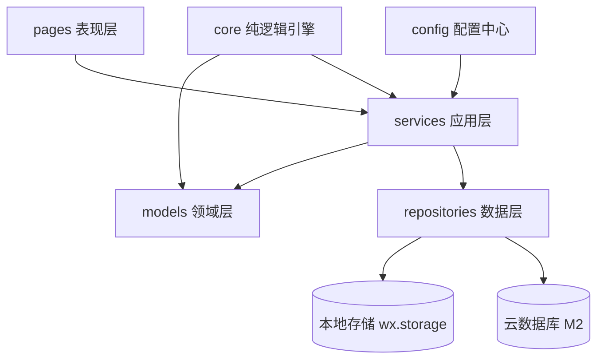
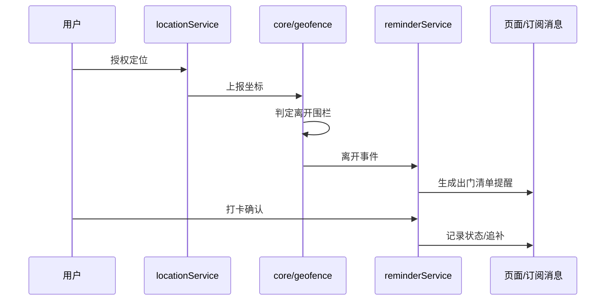

# 架构设计

> 面向单人开发，追求「模块边界清晰、可单测、可平滑演进」。
> 原则：页面不直接碰存储；核心逻辑写成纯函数；数据访问通过仓库层抽象，本地与云端可替换。

## 1. 设计原则

1. **页面只做展示与交互**，业务逻辑下沉到 services
2. **数据访问走 repository 抽象**：M1 用本地存储，M2 切云数据库时只替换实现，不动上层
3. **触发引擎与 UI 解耦**：定位监听、围栏判定独立成模块，页面订阅结果
4. **核心算法纯函数化**：围栏判定、习惯学习可脱离小程序环境单测
5. **配置集中**：AppID、云环境 ID、默认半径等集中在 config

## 2. 分层总览



## 3. 模块职责

| 层 | 目录 | 职责 |
|---|---|---|
| 表现层 | pages/ | 页面渲染、事件绑定；不写业务逻辑 |
| 应用层 | services/ | placeService / templateService / checklistService / locationService / reminderService |
| 领域层 | models/ | Place、ChecklistItem 等数据结构与校验 |
| 纯逻辑 | core/ | geofence.js（围栏判定）、habit.js（出门习惯学习）、timer.js（触发调度） |
| 数据层 | repositories/ | localRepo（现有）、cloudRepo（M2），同一接口 |
| 配置 | config/index.js | 云环境 ID、默认半径、推送模板 ID 等 |

## 4. 关键决策

### 4.1 仓库模式（Repository）
所有数据读写统一走 repository 接口（如 `getPlaces()` / `savePlace()`）。
- 现状：`utils/store.js` 直连 wx.storage
- 演进：新增 `repositories/cloudPlaceRepo.js` 实现同一接口，切换由配置决定
- 收益：M2 接云同步时页面与 services 零改动

### 4.2 定位与触发引擎
- `locationService`：封装 `wx.startLocationUpdateBackground`、授权状态、错误处理
- `core/geofence`：给定场所圆心与半径，判定 inside/outside，含去抖
- `core/habit`：记录实际离开时间，7 天学习后提前 15 分钟触发
- `reminderService`：聚合多个触发源（围栏 / 习惯定时 / 手动），统一产出"提醒事件"

### 4.3 模板数据化
模板从 JS 常量迁移为 `data/templates.json`，仓库维护，社区可通过 PR 新增场所模板。
（现状：templates.js 内嵌常量；阶段 B 迁移）

### 4.4 配置中心
`config/index.js` 集中管理：
- 云开发环境 ID（`YOUR_CLOUD_ENV`）
- 默认围栏半径
- 订阅消息模板 ID
- 天气 API 等

## 5. 数据模型

```text
Place {
  id, name, address,
  latitude, longitude, radius,
  items: string[],          // 清单物品
  checkedMap: { index: bool },
  sceneType,                // home/office/hotel/...
  createdAt
}

ReminderEvent {
  source: 'geofence' | 'habit' | 'manual',
  placeId, items, pendingItems, at
}
```

## 6. 触发链路（目标态）



## 7. 目录结构（目标态）

```text
miniprogram/
├── app.js / app.json / app.wxss
├── config/index.js
├── models/
│   ├── place.js
│   └── checklist.js
├── services/
│   ├── placeService.js
│   ├── templateService.js
│   ├── checklistService.js
│   ├── locationService.js
│   └── reminderService.js
├── core/
│   ├── geofence.js
│   ├── habit.js
│   └── timer.js
├── repositories/
│   ├── localRepo.js
│   └── cloudRepo.js       # M2
├── data/
│   └── templates.json
├── pages/
│   ├── guide/ index/ places/ templates/ settings/
│   └── checkin/ stats/    # 后续
└── utils/
```

## 8. 迭代路线

| 阶段 | 内容 | 验收 |
|---|---|---|
| A（当前） | M1 手动流程：场所 / 模板 / 打卡 | 已跑通 |
| B | 架构分层重构：页面瘦身、services/repository 落地，功能不变 | 行为回归一致 |
| C | M2 定位触发：locationService + geofence + 触发反馈 | 离开围栏出提醒 |
| D | 云同步 + 登录：cloudRepo 替换 localRepo | 多端数据一致 |
| E | 订阅消息推送：授权引导 + 下发 | 后台也能收到 |
| F | M3 智能：习惯学习 / 天气联动 / 统计 | 越用越准 |
| G | M4 发布：README / CI / 提审 | 上线 |