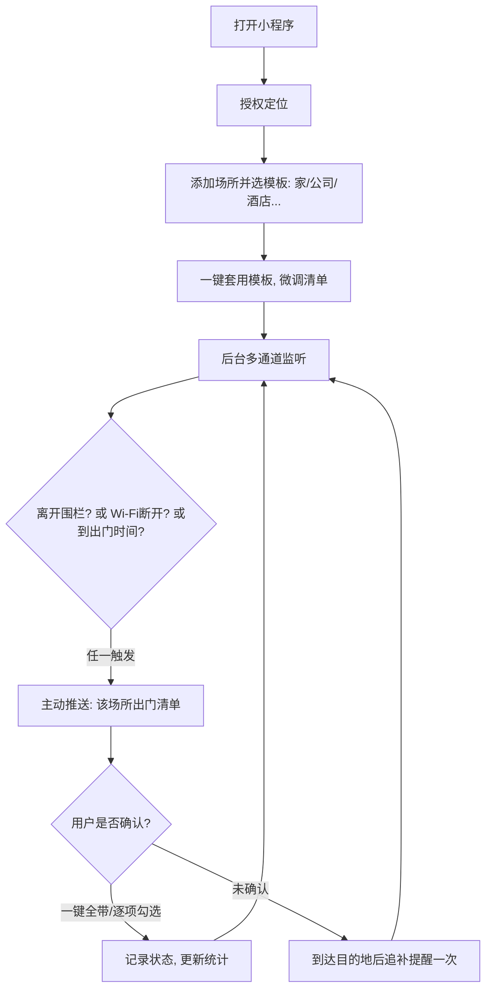

# PRD：出门别忘（暂定名）v0.3
### 基于地理围栏的「主动式出门提醒」微信小程序 —— 产品需求文档

> 文档性质：需求初稿 v0.3（已纳入「主动提示 + 多场所」需求）
> 拟稿：AI 产品经理（代拟）｜日期：2026-08-14
> 项目定位：**开源项目**，单人开发
> 目标平台：微信小程序（Android / iOS 通用）

---

## 1. 一句话概述

> 一个**主动式**的出门提醒助手：当你即将离开「家 / 公司 / 酒店 / 饭店 / 健身房」等任何场所时，系统主动推送一份**针对该场所**的携带清单，提示你可能忘带的东西（钥匙、工卡、房卡、身份证、充电器、雨伞……）。

**核心理念：健忘的人不会主动打开 App，所以一切由系统主动触发，用户的操作成本趋近于零。**

---

## 2. 背景与问题

### 2.1 为什么做这个
- 「丢三落四」是都市年轻人的高频痛点：注意力分散 + 场景切换匆忙，导致"小遗忘、大成本"（折返通勤、被锁门外、酒店退房忘东西）。
- 现有方案都不顺手：
  - 闹钟/日程是「按时间」的，不贴合「出门」这个事件；
  - 清单 App 需要**用户主动打开**——但恰恰出门那一刻最不会打开它；
  - iOS 系统级位置提醒入口深、仅苹果生态、微信内无法闭环。

### 2.2 核心洞察（本次迭代新增）
> **健忘者不会主动使用工具，工具必须比人更主动。**
1. 用户不做任何操作，系统也要提醒 —— 主动推送是主路径，App 只是配置台；
2. 场景不是"离开家"，而是「离开任意场所」——每个场所类型有完全不同的遗忘风险；
3. 提醒要「分级、多通道、可兜底」——出门前一次、离开时一次、到目的地发现没带再补一次。

---

## 3. 产品设计原则（本次新增，优先级最高）

| # | 原则 | 落地方式 |
|---|---|---|
| P1 | **零操作优先** | 配置一次，之后全靠系统主动；首页默认不要求用户"打卡" |
| P2 | **主动推送为主路径** | 离开触发 / 时间触发 / Wi-Fi 断开触发 / 到达触发，多通道抢着提醒 |
| P3 | **最小确认成本** | 一键"全带了"或只点"没带的项"；不打卡也不影响下次提醒 |
| P4 | **未确认项自动追踪** | 用户没确认的项 = 高嫌疑项，到达目的地后再补问一次 |
| P5 | **场所模板化** | 每种场所类型内置一份专家清单模板，一键套用，不用从头配 |

---

## 4. 目标用户与画像

### 画像 A：都市通勤青年（25–35 岁）
- 早高峰赶时间，出门靠"感觉"，走到地铁站才发现忘带工卡/钥匙。
- 微信重度用户，**不会为提醒工具主动打开 App**（这是设计前提）。

### 画像 B：差旅人群（28–40 岁）
- 频繁住酒店：退房忘房卡/充电器/身份证、丢三落四。
- 核心诉求：离开酒店自动提醒"退房必带清单"。

### 画像 C：学生党（18–24 岁）
- 上课/图书馆/健身房多场景切换，丢学生证、耳机、充电器。
- 预算敏感，喜欢免费 + 开源。

**共同特征**：非病理健忘、有手机、愿意一次性配置换取长期省心。
（本期不服务：阿尔茨海默患者、独居老人等医疗/照护场景。）

---

## 5. 查重与竞品分析

### 5.1 结论先行
| 维度 | 现状 | 判断 |
|---|---|---|
| GitHub 开源 | 仅零散 demo，无一成熟 |  空位 |
| 商业 App | 2–3 款 iOS 闭源 App，刚上线 |  需求被验证，但平台受限 |
| 微信小程序 | 未检索到同类 |  空位 |
| 系统级方案 | iOS 提醒事项位置提醒，入口深、仅苹果 |  部分替代 |
| 硬件方案 | AirTag/蓝牙防丢 = 找东西，≠ 出门提醒 |  互补 |

### 5.2 商业竞品弱点（本次迭代后差异化更明显）
| 产品 | 平台 | 弱点（= 我们的机会） |
|---|---|---|
| 小出行（GoOutReminder） | 仅 iOS | 只围绕"家庭位置"做清单，**无场所类型体系**；无天气/智能 |
| 出门不忘事（ExitCheck） | 仅 iOS | 多位置清单但**无场所模板、无多通道触发**、界面英文 |
| GeoReminder | iOS/Android | 通用位置提醒，**无物品清单概念** |

> **一句话差异化**：竞品做的是「离开家提醒带钥匙」，我们做的是「离开任何场所，主动提醒你该带什么」——并且是开源 + 全平台。

---

## 6. 场所类型与清单模板库（本次核心新增）

> 每种场所类型内置一份"专家清单"，用户一键套用后可增删。这是让"多场景"可落地的关键。

| 场所类型 | 典型触发场景 | 默认模板（示例） |
|---|---|---|
|  家 | 出门上班/上学 | 钥匙、手机、钱包、工卡、充电器、雨伞（雨天） |
|  公司/办公室 | 下班 | 工卡、电脑、充电器、耳机、雨伞 |
|  酒店 | 退房/外出 | 房卡、身份证、充电器、洗漱包、机票/车票、房费收据 |
|  饭店/餐厅 | 离店 | 手机、钱包、外套、雨伞、打包袋 |
|  健身房 | 离场 | 毛巾、换洗衣物、水杯、耳机、健身卡 |
|  学校/图书馆 | 离馆 | 学生证、课本、电脑、充电器、水杯 |
|  医院 | 离院 | 病历本、医保卡、处方、检查单 |
|  商场/超市 | 离店 | 购物袋、口罩、雨伞、停车卡 |
|  车站/机场 | 出发 | 身份证、车票/登机牌、充电宝、钥匙、雨伞 |

> 用户可自定义任意场所 + 自定义清单；模板是开源仓库的一部分，社区可 PR 补充更多场所模板。

---

## 7. 核心需求（功能清单）

### P0 —— MVP（必须做）
| # | 功能 | 说明 |
|---|---|---|
| F1 | 场所管理 | 添加任意场所（定位/选点），围栏半径可调（50–500m）；支持至少 3 个场所 |
| F2 | 场所模板库 | 内置 5+ 场所类型模板一键套用；可增删改 |
| F3 | **多通道主动触发** | ① 离开围栏触发（GPS）；② Wi-Fi 断开触发（省电补充）；③ 定时触发（按历史出门习惯提前 10 分钟）|
| F4 | 主动推送 | 微信订阅消息 + 小程序内浮窗；**未确认项不打扰式追补**（到目的地后再问一次） |
| F5 | 最小确认 | 一键"全带了"；或只点"没带"项；确认状态云端同步 |
| F6 | 天气联动 | 预报有雨时自动在清单置顶「雨伞」 |
| F7 | 隐私 | 定位仅用于触发；可一键关闭定位/清数据；开源透明 |

### P1 —— 增强
- **到达触发**：到达酒店/公司后提醒"入住登记/到岗检查"（反向防漏）；
- 忘带统计：按场所/物品统计遗漏频率，智能排序清单；
- 静默模式：按时间段/地点免打扰；
- 日历/差旅联动：读取机票酒店行程，自动生成"出差清单"；
- 分享清单：家庭/情侣共享一份清单，家人帮对方确认。

### P2 —— 远期
- 蓝牙信标 / NFC 贴片：自动检测物品是否真在身边（钥匙贴信标 → 系统替你确认）；
- AI 语音助手："我出门要带什么？"（大模型问答）；
- 智能学习：根据打卡历史自动生成/调整模板；
- 老人关怀模式：子女远程维护清单（合规门槛高）。

### 明确不做（本期）
- 不做「找东西/物品追踪」（硬件赛道）；
- 不做医疗级照护（责任与合规风险）；
- 不做复杂社交。

---

## 8. 关键用户流程

---

## 9. 非功能需求

| 类别 | 要求 |
|---|---|
| 隐私 | 定位仅用于触发；本地优先、可自托管；隐私政策公开 |
| 耗电 | 低频采样 + Wi-Fi 辅助 + 可关闭；后台耗电目标 < 5%/天（参考竞品量级） |
| 性能 | 冷启动 < 2s；推送延迟 < 30s |
| 合规 | 定位接口用途声明；个人信息保护法；小程序类目「效率-工具」 |
| 稳定性 | 推送丢失兜底（下次打开补提醒）；多端不冲突 |

---

## 10. 技术方案建议（单人开发版）

| 层 | 选型 | 理由 |
|---|---|---|
| 小程序 | 微信原生（或 Taro 备选） | 定位 API 原生支持，个人开发最省心 |
| 定位 | `wx.startLocationUpdateBackground` + `requiredBackgroundModes:[location]` | 官方后台位置方案 |
| Wi-Fi 触发 | 监听网络状态变化（`wx.onNetworkStatusChange`）辅助判定 | 省电 + 与 GPS 互备 |
| 围栏判定 | 前端计算与场所圆心距离 | 后端零实时计算 |
| 推送 | 订阅消息（引导多次授权）+ 浮窗兜底 | 个人主体通道限制下的最优解 |
| 后端 | 微信云开发（云函数 + 云数据库 + 定时触发器） | 免费额度够用、免运维 |
| 开源 | GitHub + MIT + README + CONTRIBUTING + GitHub Actions | 开源基本盘 |

---

## 11. MVP 范围与验收标准

**MVP = F1 + F2 + F3 + F4 + F5 + F6 + F7**（≥3 场所 + 5 模板 + 多通道触发）

验收标准：
1. 配置「家 / 公司 / 酒店」三个场所后，离开任一场馆围栏 3 分钟内收到对应清单；
2. Wi-Fi 断开通道可触发（真机验证）；定时通道按历史出门习惯提前 10 分钟提醒；
3. 收到提醒后一键"全带了"或标记未带项，状态可查；
4. 未确认项在到达目的地后追补提醒一次；
5. 有雨预报时清单自动置顶「雨伞」；
6. 杀进程/退出小程序后仍能收到提醒（以真机为准）；
7. 不开定位也能用（手动出门打卡降级），不崩溃。

---

## 12. 里程碑计划（单人，建议节奏）

| 阶段 | 周期 | 目标 |
|---|---|---|
| M0 需求确认 | 本周 | 确认 v0.3，锁定 MVP 与命名 |
| M1 原型验证 | 1–2 周 | 小程序骨架 + 定位授权 + 场所/模板配置 + 手动出门打卡 |
| M2 核心闭环 | 2–3 周 | GPS/Wi-Fi/定时三通道触发 + 推送 + 打卡 + 云同步 |
| M3 打磨 | 1 周 | 天气联动、忘带统计、追补提醒、节电、真机兼容 |
| M4 开源发布 | 1 周 | README / License / 贡献指南 / 演示视频 / GitHub + 小程序提审 |

---

## 13. 风险与应对

| 风险 | 说明 | 应对 |
|---|---|---|
| iOS 后台定位不稳 | 依赖微信进程 | GPS + Wi-Fi 双通道；手动模式兜底 |
| 用户不给后台权限 | 授权流失 | 首次引导讲清价值；不授权也能用 |
| 订阅消息一次性授权 | 个人开发者无长期订阅 | 多次引导授权 + 浮窗兜底 + 鼓励添加到桌面 |
| 小程序审核 | 定位类目/接口资质 | 提前申请 getLocation 用途声明；类目「效率-工具」 |
| 耗电投诉 | 后台定位耗电 | 低频采样 + Wi-Fi 辅助 + 开关 |
| 多场所清单变复杂 | 配置负担 | 模板库一键套用，配置总时长 < 3 分钟 |

---

## 14. 待你确认的问题

1. **命名**：暂定「出门别忘」，你有偏好吗？
2. **触发优先级**：三通道触发（离开围栏 / Wi-Fi 断开 / 定时）全做，还是 MVP 先做「离开围栏 + 定时」两个？（Wi-Fi 通道开发量中等，我建议先做两个，Wi-Fi 放 M3）
3. **追补提醒**：到目的地后再问一次"没确认的项"，会不会烦？还是只在"高嫌疑项"（历史常忘）上追补？（我建议后者，更克制）
4. **技术栈**：微信原生小程序 OK 吗？
5. **开源节奏**：是先上线小程序再开源，还是仓库从第一天就公开（边做边开源）？（我建议从第一天公开，能吸引贡献者一起补模板库）

> v0.3 相对 v0.1 的核心变化：新增「产品设计原则」（主动优先/零操作）、「场所类型与模板库」、触发从单一"离开家"升级为「多通道主动触发 + 未确认项追补」，差异化从"开源"升级为"**开源 + 全平台 + 全场所 + 主动式**"。